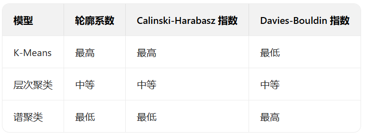

# music_data_analysis_project

# 项目概述

本项目旨在通过对尼日利亚歌曲的音频特征进行聚类分析，探索不同音乐类型的特征差异，并分析影响歌曲流行度的关键因素。项目使用多种聚类算法对歌曲特征进行分组，评估各模型性能，并通过可视化手段深入理解不同簇的音乐特征和类型分布。

# 数据理解

数据集包含以下主要字段：

name：歌曲名称

album：所属专辑

artist：艺术家

artist_top_genre：艺术家的主要音乐类型

release_date：发行日期

length：歌曲长度

popularity：流行度

danceability：可舞性

acousticness：声学性

energy：活力

instrumentalness：器乐性

liveness：现场感

loudness：响度

speechiness：语音性

tempo：节奏

time_signature：节拍

# 数据预处理

1. 特征选择：选取与音频特征相关的11个连续变量作为分析特征

2. 数据标准化：使用StandardScaler对特征进行标准化处理，确保各特征具有相同权重

# 数据分析流程

1. 确定最佳簇数

- 肘部法则(Elbow Method)

    - 计算1到10个簇的WCSS(Within-Cluster Sum of Squares)

    - 观察WCSS随簇数变化的曲线，寻找"肘部"拐点

- 轮廓系数法(Silhouette Score)

    - 计算2到10个簇的轮廓系数

    - 选择轮廓系数最高的簇数作为最佳簇数

2. 多模型训练与比较

- K-Means聚类：基于质心的划分式聚类算法

- 层次聚类：通过构建聚类树进行层次化分组

- 谱聚类：基于图论的聚类方法，适用于复杂形状簇

3. 聚类结果可视化与评估

- 使用PCA降维到2维空间进行聚类结果可视化

- 计算多种评估指标比较模型性能：

    - 轮廓系数(Silhouette Score)：衡量簇内紧凑度和簇间分离度

    - Calinski-Harabasz指数：评估簇间差异与簇内方差的比率

    - Davies-Bouldin指数：衡量簇间相似性，值越低越好

4. 特征深度分析

- 计算各簇特征均值，通过热图展示簇间特征差异

- 使用箱线图分析各特征在不同簇中的分布情况

- 分析音频特征与流行度的相关性，识别关键影响因素

5. 音乐类型分析

- 分析各簇中不同音乐类型的分布比例

- 使用堆叠柱状图可视化各簇的音乐类型组成

- 探索音乐类型与音频特征之间的关系

6. 流行度相关分析

- 构建流行度与关键音频特征的散点图矩阵

- 分析舞蹈性、能量感、响度等特征与流行度的关系

- 识别对流行度影响最大的音频特征

# 模型构建与评估

模型构建过程

1. 数据准备：选择相关特征并进行标准化处理

2. 模型训练：使用三种算法训练聚类模型

3. 标签分配：为每个样本分配聚类标签

评估指标解释

1. 轮廓系数：衡量聚类效果的常用指标，值越大越好

2. Calinski-Harabasz指数：衡量聚类效果的常用指标，值越大越好

3. Davies-Bouldin指数：衡量聚类效果的常用指标，值越小越好

模型性能比较

通过对三种模型的评估，得到以下性能比较结果：

结论：K-Means模型在本次分析中表现最佳，具有最高的轮廓系数和Calinski-Harabasz指数，同时Davies-Bouldin指数最低，表明其簇内紧凑度和簇间分离度
最优。

# 结论与建议

主要发现

1. 最佳簇数：通过轮廓系数法确定最佳簇数为5

2. 模型性能：K-Means算法在本次分析中表现优于层次聚类和谱聚类

3. 特征分析：

   - 流行度与舞蹈性(danceability)、能量感(energy)呈较强正相关

   - 原声程度(acousticness)与流行度呈负相关

   - 响度(loudness)和节奏(tempo)对流行度有一定影响

4. 音乐类型：

   - 不同簇中音乐类型分布存在明显差异

   - 某些簇以特定音乐类型为主（如Afrobeats、Hip Hop等）

可视化洞察

1. 聚类结果可视化：显示不同模型的簇分布差异，K-Means生成的簇分布更均匀

2. 特征箱线图：展示了各簇在关键特征上的显著差异

3. 热图分析：清晰呈现了各簇的特征均值差异

4. 流行度相关性分析：确定了影响流行度的关键音频特征

# 实际应用建议

1. 音乐推荐系统：基于聚类结果构建更精准的音乐推荐模型，根据用户偏好推荐相似簇的歌曲

2. 音乐创作指导：为音乐创作者提供数据支持，了解不同音乐类型的特征组合和流行趋势，从而提高音乐创作效率

3. 市场营销策略：针对不同簇的音乐特征制定差异化的推广策略，提高歌曲流行度

4. 音乐类型研究：进一步探索各簇音乐类型的特征组合，为音乐类型分类和演化研究提供数据支持

# 未来工作方向

1. 引入更多元数据（如发行时间、歌手信息等）进行更全面的分析

2. 尝试其他聚类算法或组合多种算法进行集成聚类

3. 进行时间序列分析，探索音乐特征和流行度随时间的变化趋势

4. 结合自然语言处理技术分析歌词内容，丰富音乐分析维度

# 

通过本项目的分析，深入了解了尼日利亚歌曲的音频特征分布和聚类模式，为音乐分析和相关应用提供有价值的数据支持和洞见。