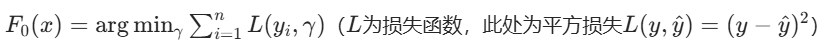
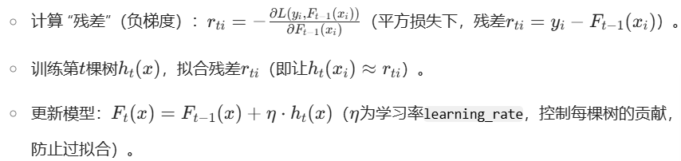
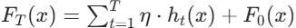
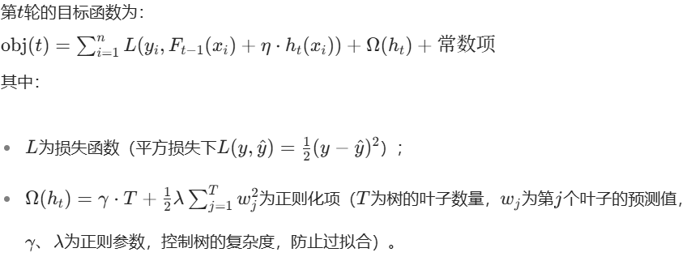
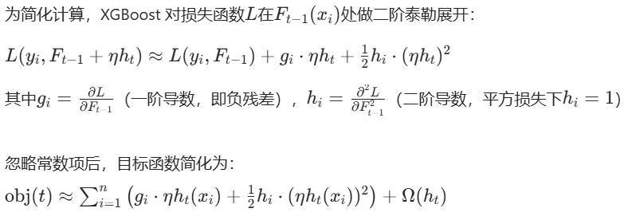
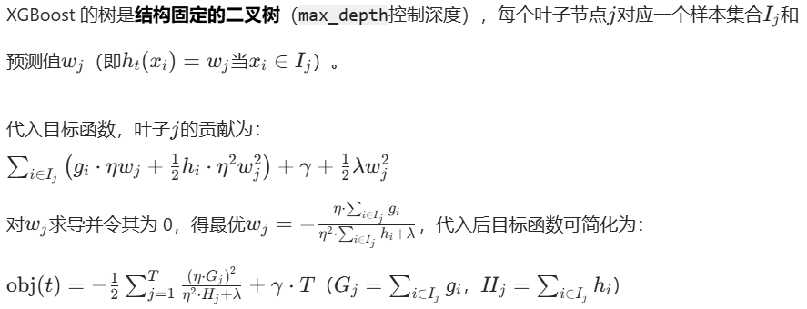
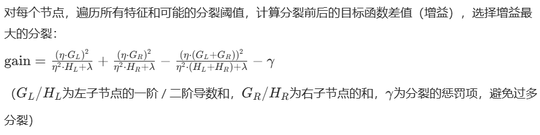
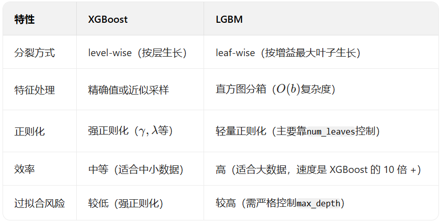

# 一、梯度提升的基础框架（LGBM/XGBoost 共通）
无论 LGBM 还是 XGBoost，整体学习流程遵循梯度提升的基本逻辑：

- 初始化模型：用一个简单模型（如常数）作为初始预测，例如用训练集High Price的均值作为第 0 轮预测：

- 迭代训练树：对t=1,2,...,T（T为树的总数量，即n_estimators）：
    

- 最终预测：

# 二、XGBoost 的学习过程（核心优化：二阶泰勒展开 + 正则化）

XGBoost 对传统 GBDT 的改进主要体现在目标函数的精细化和分裂策略的高效性，以下是其树的迭代过程：

- 步骤 1：定义目标函数（含正则化）第t轮的目标函数为：
    

- 步骤 2：用二阶泰勒展开近似目标函数
    

- 步骤 3：构建第t棵树（寻找最优分裂）
    

- 步骤 4：选择最优分裂点（贪心算法）
    

- 步骤 5：剪枝与正则化XGBoost 
    通过限制max_depth、min_child_weight、gamma（分裂增益阈值）等参数，剪去冗余分支，控制树的复杂度。

# 三、LGBM 的学习过程（核心优化：直方图算法 + 叶子 - wise 生长）
LGBM（LightGBM）的核心优势是效率，通过 “直方图算法” 和 “叶子 - wise 生长” 大幅减少计算量，适合大数据场景，其学习过程如下：
- 步骤 1：特征分箱（直方图算法）
    
    LGBM 将连续特征的取值分箱为直方图（例如将 “重量” 分为 [0,1kg)、[1,2.5kg)、[2.5kg+] 等区间），每个区间对应一个 “桶”。
    
    优势：无需遍历每个样本的具体值，只需统计每个桶的G_j（一阶导数和）和H_j（二阶导数和），分裂时直接基于桶计算增益，计算量从O(n)降至O(b)（b为桶数量，通常(b=255)）。

- 步骤 2：叶子 - wise 生长（而非 level-wise）

    传统 GBDT 和 XGBoost 采用 “level-wise” 生长（同一层所有节点同时分裂），而 LGBM 采用 “叶子 - wise”：

    每次从当前所有叶子中，选择增益最大的叶子进行分裂（而非按层分裂），直到达到max_depth或num_leaves上限。

    优势：用更少的叶子节点达到相同精度（减少树的复杂度），但需通过max_depth限制深度，避免过拟合。

- 步骤 3：梯度 - based 单侧采样（GOSS）

    为进一步减少样本量，LGBM 对样本采样时：

    保留梯度绝对值大的样本（对损失影响大）；
    
    随机采样梯度绝对值小的样本（比例由subsample控制）；
    
    计算增益时对小梯度样本的权重进行校正，保证采样后的分布近似原始分布。

- 步骤 4：类别特征自动处理
    LGBM 支持直接输入类别特征（无需 one-hot 编码），通过 “many-vs-many” 分裂策略：

    对类别特征的所有取值，找到最优划分（如将 {A,B} 划分为左子节点，{C,D} 划分为右子节点），计算分裂增益，避免 one-hot 导致的维度爆炸。

# 四、XGBoost 与 LGBM 的核心差异总结

在南瓜价格预测项目中，两者均通过迭代拟合残差学习价格规律，但 LGBM 因直方图和叶子 - wise 生长，训练速度更快；XGBoost 因强正则化，在小样本下可能更稳定。
