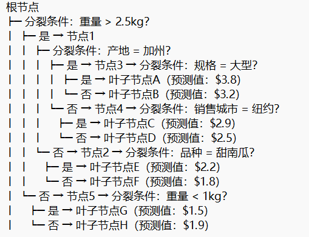

## 单棵回归树的结构（以 GBDT 中的某棵树为例）
- 梯度提升树中的单棵树通常是浅决策树（max_depth=5），结构如下（基于南瓜价格预测场景简化）：

- 结构说明：

    每个非叶子节点包含分裂特征（如 “产地”）和分裂阈值（如 “>2.5kg”“= 加州”）；

    叶子节点的 “预测值” 是该分支下所有训练样本High Price的均值（回归树的典型输出）；

    树深度为 5（从根到叶子最多 5 层），控制模型复杂度避免过拟合。

## 一条分支的含义（以 “根节点→节点 1→节点 3→叶子节点 A” 为例）

- 这条分支的完整逻辑是：如果南瓜重量 > 2.5kg，且产地是加州，且规格为大型 → 预测High Price为$3.8  

- 含义解读：

    模型从训练数据中学习到：“重量大（>2.5kg）、产地为加州、规格大” 的南瓜，历史平均高价（High Price）为 $3.8；

    分支中的特征顺序（先重量、再产地、后规格）反映了模型对特征重要性的判断：重量对价格的影响比产地更显著（优先分裂），产地又比规格更显著。

## 单棵树的生长过程

回归树的生长是从根节点开始，通过 “贪心分裂” 逐步生成子节点的过程，核心目标是最小化分裂后子节点的 “平方误差”（因目标是预测连续值High Price）。

以项目数据为例，生长步骤如下：

- 步骤 1：确定根节点的分裂特征和阈值

    遍历所有候选特征（如重量、产地、规格等），对每个特征尝试所有可能的分裂阈值，计算分裂后 “左右子节点的平方误差之和”，选择误差最小的分裂方式。

    假设对 “重量” 特征计算：

    若以 “2.5kg” 为阈值，左子节点（≤2.5kg）样本的High Price均值为$2.0，平方误差和为5.2；右子节点（>2.5kg）均值为$3.0，平方误差和为 4.8，总误差 = 5.2+4.8=10.0。

    对比其他特征（如产地）的分裂误差（假设总误差为 12.0），最终选择 “重量> 2.5kg” 作为根节点分裂方式（误差更小）。

- 步骤 2：分裂节点 1（右子节点，重量 > 2.5kg）

    对 “重量> 2.5kg” 的样本，再次遍历剩余特征（产地、规格等），计算分裂误差。

    假设 “产地 = 加州” 分裂后：

    左子节点（产地 = 加州）样本均值$3.5，平方误差和2.1；右子节点（非加州）均值$2.7，平方误差和 1.9，总误差 = 4.0（小于其他特征的分裂误差）。

    因此，节点 1 以 “产地 = 加州” 为分裂条件。

- 步骤 3：分裂节点 3（产地 = 加州，重量 > 2.5kg）

    对 “重量> 2.5kg 且产地 = 加州” 的样本，继续遍历特征（如规格）。

    若以 “规格 = 大型” 为阈值，分裂后左子节点（大型）均值$3.8，平方误差和0.5；右子节点（非大型）均值$3.2，平方误差和 0.6，总误差 = 1.1（最小）。

    因此，节点 3 以 “规格 = 大型” 为分裂条件，生成叶子节点 A（预测值$3.8）和B（预测值$3.2）。

- 步骤 4：停止生长

    当树深度达到预设的max_depth=5，或子节点样本数少于阈值（如 < 5 个）时，停止分裂，将当前节点设为叶子节点，输出该节点样本的High Price均值。