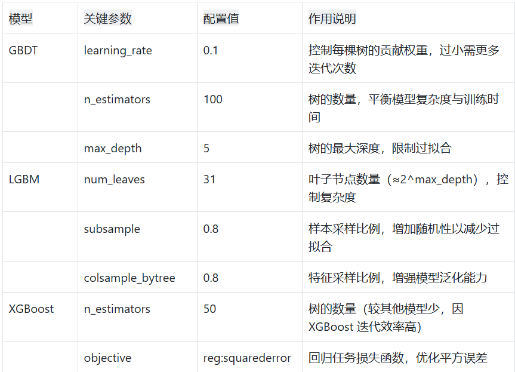

# 项目概述​
本项目基于美国南瓜数据集（US-pumpkins.csv），通过机器学习方法构建价格预测模型，旨在探索影响南瓜价格（High Price）的关键因素，并实现对南瓜价格的精准预测。项目采用了三种主流的树集成模型 ——GBDT（梯度提升树）、LGBM（轻量梯度提升机）和 XGBoost（极端梯度提升），通过完整的数据处理、特征工程、模型训练与评估流程，对比不同模型的预测性能，为南瓜市场价格分析提供数据支持。​

项目核心价值在于：​
    
-量化分析影响南瓜价格的关键特征（如产地、规格、品种等）​

-构建可复用的价格预测模型，为种植户、经销商提供决策参考​

-展示树模型在结构化数据预测任务中的应用流程与优化思路

# 一、数据详情（US-pumpkins.csv）​

## 1. 数据基本构成​

-目标变量：以High Price作为核心预测目标，所有建模与分析均围绕该变量展开​

-特征类型：​

数值特征：包括与价格相关的量化指标（如低价等）​

分类特征：涵盖南瓜的种类、规格、产地、销售城市、交易方式等定性信息​

数据规模：原始数据包含多维度特征，经缺失值处理后保留有效样本​

## 2. 缺失值处理逻辑​

-通过drop_high_missing_cols函数执行缺失值筛选：​

设定阈值MISSING_THRESHOLD=0.75，删除缺失率≥75% 的特征列​

保留特征的缺失值通过删除缺失行处理（避免填充操作引入噪声）​

-处理依据：高缺失特征（如缺失率超 75%）的信息价值低，强行保留会导致模型偏差；低缺失特征删除缺失行对样本量影响较小，且能保证数据质量​

## 3. 特征分布与价值分析​

-日期特征：经可视化与相关性分析，日期特征呈现零散分布且无显著规律，对价格预测无实质贡献，实际建模中可忽略​
 
-分类特征分析：​通过plot_categorical_vs_target函数生成分类特征与High Price的关系图，例如：​若 "产地 A" 在多次可视化中稳居 High Price 均值前 5，说明该产地样本量充足且价格表现稳定​，未出现在 Top5 的类别可能因样本量少或价格波动大，对模型贡献有限​

数值特征相关性：analyze_correlation函数计算数值特征与High Price的相关系数，可快速识别强关联特征​
# 二、特征处理流程​

## 1. 预处理全流程​

-特征筛选：基于缺失率阈值删除高缺失列

-样本清洗：删除保留特征中的缺失行​

-数据集拆分：​按TEST_SIZE=0.2拆分训练集（80%）与测试集（20%）​，固定RANDOM_STATE=42确保拆分结果可复现​

-特征编码：​

one-hot 编码（树模型对编码方式敏感性低，无需依赖顺序编码）​
    
数值特征无需标准化 / 归一化（树模型通过节点分裂处理数值差异，不受量纲影响）​

## 2. 特征工程关键说明​

-多重共线性处理：树模型对多重共线性不敏感，无需严格消除数值特征间的相关性​

-特征重要性关联：预处理阶段的相关性分析结果可与模型训练后的特征重要性形成互证（如高相关特征通常在模型中具有高重要性）​

-特征删除影响：若原始数据高缺失特征占比过高，删除后可能导致样本量不足，模型有过拟合风险（通过交叉验证监测）​

# 三、模型构建与参数说明​

## 1. 模型选择依据​

本项目选用三种树集成模型的原因：​

-对非线性关系捕捉能力强（价格与特征的关系多为非线性）​

-无需复杂特征预处理（如归一化、手动特征交互）​

-在结构化数据预测任务中表现稳定，泛化能力优于单一决策树

## 2. 核心参数配置与作用

## 3. 模型学习规律解析​

-关键影响特征：模型通过特征重要性自动识别核心因素，例如：​

分类特征：特定产地（如BOSTON）、大规格南瓜的价格显著偏高（与plot_categorical_vs_target可视化结果一致）​

数值特征：与High Price强相关的指标成为主要分裂依据​

-误差模式：通过show_and_export函数生成的残差图可分析：​

残差均匀围绕 0 波动：模型无系统性偏差​

特定类别样本残差偏大：可能存在未捕捉的特殊规律（如突发市场因素）​

-关键样本分析：output_key.csv记录的 best5（误差最小）、worst5（误差最大）、median5（误差中等）样本：​

best5：特征符合模型学习的主流规律，预测稳定性高​

worst5：可能包含异常值或罕见特征组合，需人工复核

# 四、模型评估与结果解读​

## 1. 评估指标说明​

-通过evaluate_model函数输出以下指标：​

MSE（均方误差）：衡量预测值与真实值的平均平方差，值越小越好​

R²（决定系数）：表示模型解释目标变量变异的比例，越接近 1 说明拟合效果越好​

## 2. 结果文件说明​

-output.json：记录三种模型在训练集 / 测试集的 MSE 和 R²，便于横向对比​

-output_key.csv：存储关键样本（best5/worst5/median5）的特征与误差信息，支持深度分析​

-可视化图表：包括真实值 vs 预测值折线图、残差折线图，直观展示模型性能​

## 3. 过拟合控制策略​

-对比训练集与测试集指标：若训练集 MSE 远小于测试集，提示过拟合​
 
-优化方向：​

减小max_depth或num_leaves降低模型复杂度​
    
降低subsample或colsample_bytree增加采样随机性​

增加n_estimators同时降低learning_rate（平衡训练时间）

# 五、文件结构说明

-configuration.py：存储全局参数（缺失值阈值、测试集比例、模型参数网格等）​

-data_analysis.py：数据加载、探索、缺失值处理、相关性分析函数​

-model.py/lgbm_model.py/xgb_model.py：分别实现 GBDT、LGBM、XGBoost 模型的训练逻辑​

-evaluate.py：模型评估指标计算函数​

-visualize_line.py：可视化与关键样本分析函数​

-main.py：主程序入口，串联数据处理、模型训练、评估全流程
 
-readme.md：项目文档
