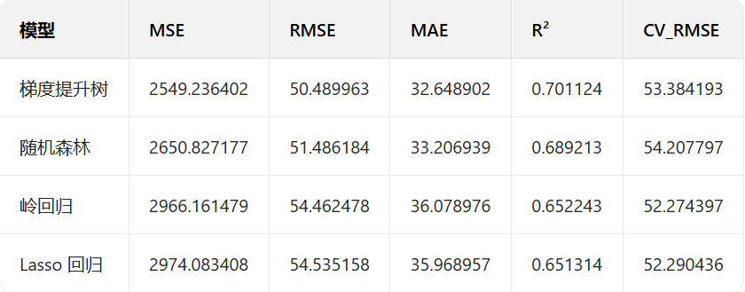
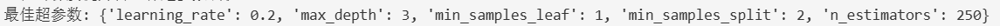
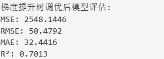
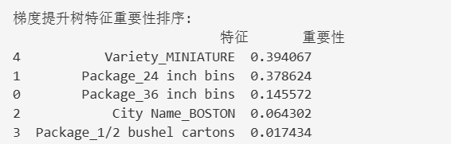
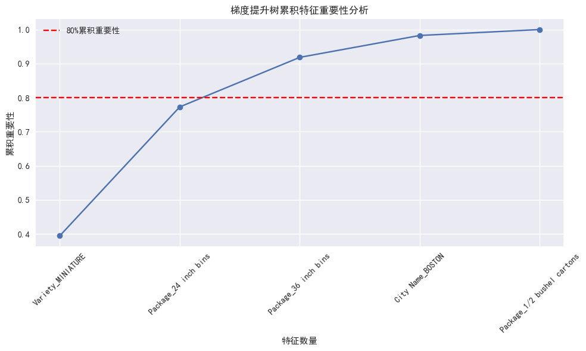

# 南瓜价格预测分析报告

# 项目概述

本项目旨在通过分析美国南瓜市场价格数据，建立预测模型来预测南瓜的高价 (High Price)，并深入分析影响南瓜价格的关键因素。使用了多种机器学习模
型，并对梯度提升树模型进行了超参数调优，最终得到了性能较好的预测模型。同时，还对特征重要性、价格影响因素等进行了详细分析。

# 数据集介绍

数据集为US-pumpkins.csv，包含美国多个城市的南瓜价格及相关信息。数据集包含以下主要字段：

City Name：城市名称

Package：包装类型

Variety：南瓜品种

Date：日期

Low Price：最低价格

High Price：最高价格

Mostly Low：多数低价

Mostly High：多数高价

Origin：产地

Item Size：南瓜尺寸

Color：颜色

数据集共有 1757 行，26 列

# 数据预处理

1. 缺失值处理

首先检查了各列的缺失值情况，发现许多列存在大量缺失值。设定缺失值比例阈值为75%，删除了缺失值比例超过该阈值的列。删除后，主要剩余列的缺失值情况如下：

Variety：5 个缺失值

Mostly Low：103 个缺失值

Mostly High：103 个缺失值

Origin：3 个缺失值

Item Size：279 个缺失值

Color：616 个缺失值

对于剩余的缺失值，使用了以下填充策略：

Variety、Origin、Item Size、Color：填充为 'unknown'

2. 数据类型转换

将价格相关列 (Low Price、High Price、Mostly Low、Mostly High) 转换为数值类型，去除了美元符号和逗号；

将Date列转换为日期类型

3.特征编码

对分类变量进行了独热编码 (One-Hot Encoding)，包括：

City Name、Package、Variety、Origin、Item Size、Color、Repack

编码后数据集形状变为 (1757, 76)

# 探索性数据分析

1. 相关性分析

计算了各特征与High Price的相关性，发现以下特征与High Price相关性较强：

Mostly High：0.996174

Mostly Low：0.989539

Low Price：0.987353

Package_36 inch bins：0.433154

Package_24 inch bins：0.337257

City Name_BOSTON：0.303481

Package_1/2 bushel cartons：-0.504620

Variety_MINIATURE：-0.544909

2. 可视化分析

绘制了特征相关性热力图，直观展示了各特征之间的相关性。从热力图中可以看出，价格相关的几个特征之间存在很强的相关性，这与计算的相关系数结果一
致。

# 模型建立与评估

1. 模型选择

岭回归 (Ridge)

Lasso 回归 (Lasso)

随机森林 (RandomForestRegressor)

梯度提升树 (GradientBoostingRegressor)

2. 评估指标

使用了以下评估指标：

均方误差 (MSE)、均方根误差 (RMSE)、平均绝对误差 (MAE)、决定系数 (R²)、交叉验证均方根误差 (CV_RMSE)

3. 模型评估结果

从结果来看，梯度提升树模型表现最佳，决定系数(R²)为0.7011，说明该模型能够解释约70%的价格变化

4. 模型调优

对梯度提升树模型进行了网格搜索超参数调优，调优的参数包括：

n_estimators：100, 150, 200, 250

learning_rate：0.05, 0.1, 0.15, 0.2

max_depth：3, 5, 7, 9

min_samples_split：2, 5, 10, 15

min_samples_leaf：1, 2, 3, 4

5. 最佳超参数

调优后模型评估：

调优后的模型性能略有提升，R²提高到了0.7013

# 特征重要性分析

1. 特征重要性排序

使用调优后的梯度提升树模型分析了特征重要性，结果如下：

2. 累积重要性分析

绘制了累积特征重要性图，发现前两个特征 (Variety_MINIATURE和Package_24 inch bins) 的累积重要性已接近80%，说明这两个特征对价格的影响最大

# 价格影响因素分析

1. 包装类型对价格的影响

分析了不同包装类型的南瓜平均价格，发现包装为24 inch bins和36 inch bins的南瓜价格较高，而1/2 bushel cartons的价格较低。

2. 波士顿地区价格趋势

分析了波士顿地区的南瓜价格年度趋势，发现价格随年份变化的趋势不明显，可能需要更长时间的数据来观察趋势。

3. 迷你型南瓜尺寸与价格关系

分析了迷你型 (MINIATURE) 南瓜不同尺寸的价格差异，发现尺寸对价格有一定影响，但差异不大。